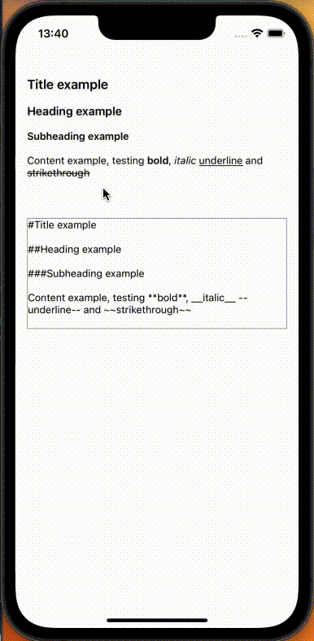

# react-markdown-editor



## Usage

Checkout /app-sample for usage example

```
const {
  inputBlockInfoMap,
  markdown,
  currentLineStyle,
  currentTextStyles,
  onChangeText,
  onSelectionChange,
  onTextStyle,
  onLineStyle,
  onAddPhoto,
  onRemovePhoto,
} = useTextEditor({ initialMarkdownText });

  ...

  const inputBlockKeys = Object.keys(inputBlockInfoMap) as LineKey[];
  <>
    {inputBlockKeys.map((inputBlockKey, i) => {
          const inputBlockInfo = inputBlockInfoMap[inputBlockKey];
          if (inputBlockInfo.type === 'text') {
            const { text, textStyleMap, lineStyleMap } = inputBlockInfo;
            return (
              <TextInput
                ...
                onChangeText={(newText: string) =>
                  onChangeText(inputBlockKey, newText)
                }
                onEndEditing={() => {
                  if (markdown != initialMarkdownText) {
                    onEndEditing(markdown);
                  }
                }}
                onSelectionChange={({
                  nativeEvent: { selection },
                }: NativeSyntheticEvent<TextInputSelectionChangeEventData>) =>
                  onSelectionChange(inputBlockKey, selection)
                }
              >
                <MarkdownText
                  lineStyleMap={lineStyleMap}
                  textStyleMap={textStyleMap}
                >
                  {text}
                </MarkdownText>
              </TextInput>
            );
          } else {
            const { imgUrl } = inputBlockInfo;
            return (
              <Image
                source={{ uri: `data:image/png;base64,${imgUrl}` }}
                resizeMode={'cover'}
              />
            );
          }
        })}
        </>

```

## Motivation and examples

Built to handle text style editor on Gradoo Reports module, main idea is to handle/store in a markdown syntax. The user change the style of the line, enterying/typing text or on the text selection.

Created based top of the [TextInput](https://reactnative.dev/docs/textinput) callbacks from `react-native`, but can used in react since this modules doesn't import any `react-native` dependence.

- `onChangeText: (inputBlockInfoKey: LineKey, text: string)`
- `onSelectionChange: (inputBlockInfoKey: LineKey, selection: Selection)`

The user can entry text, style the text and also enter image, so the lib handle as input blocks

Markdown example

```
//raw
#Title Example/9j/4AAQSkZJRgABAQAASABIAAD/4_BASE64_.../2Q==</img>\n##Heading Example\n\nBody **bold** and __italic__\n\n###Subheading Example\n\n\nBody --underline-- and ~~strikethrough~~

//by line
#Title Example
/9j/4AAQSkZJRgABAQAASABIAAD/4_BASE64_.../2Q==</img>
##Heading Example

Body **bold** and __italic__

###Subheading Example


Body --underline-- and ~~strikethrough~~
```

Input block example

```
{
  "0": {
    "type": "text",
    "text": "Title Example",
    "lineStyleMap": {
      "0": "#"
    },
    "textStyleMap": {

    },
    "currentSelectionKey": "13:13",
    "lastSelectionKey": "0:0"
  },
  "1": {
    "type": "image",
    "imgUrl": "/9j/4AAQSkZJRgABAQAAS_BASE_"
  },
  "2": {
    "type": "text",
    "text": "\nHeading Example\n\nBody bold and italic\n\nSubheading Example\n\n\nBody underline and strikethrough",
    "lineStyleMap": {
      "0": "body",
      "1": "##",
      "2": "body",
      "3": "body",
      "4": "body",
      "5": "###",
      "6": "body",
      "7": "body",
      "8": "body"
    },
    "textStyleMap": {
      "23:27": [
        "**"
      ],
      "32:38": [
        "__"
      ],
      "66:75": [
        "--"
      ],
      "80:93": [
        "~~"
      ]
    },
    "currentSelectionKey": "93:93",
    "lastSelectionKey": "0:0"
  }
}
```

The example better shows the core logic of the lib, we store as a `markdown` string but we handle the user change in structured `inputBlockInfoMap` object and both are converted to each other (`mardownToInputBlockInfoMap` and `inputBlockInfoMapToMarkdown`)

So a basic example of the edit flow (more examples on tests)

```
'|' => 'Hey title|'
"0": {
  type: "text",
  text: "Hey title",
  lineStyleMap: {
    "0": "body",
  },
  textStyleMap: {},
  currentSelectionKey: "9:9",
  lastSelectionKey: "0:0",
}

'Hey title|' => '#Hey title|'
"0": {
  type: "text",
  text: "Hey title",
  lineStyleMap: {
    "0": "#",
  },
  textStyleMap: {},
  currentSelectionKey: "9:9",
  lastSelectionKey: "0:0",
}

'#Hey title|' => '#Hey title\n|'
"0": {
  type: "text",
  text: "Hey title\n",,
  lineStyleMap: {
    "0": "#",
    "1": "body",
  },
  textStyleMap: {},
  currentSelectionKey: "10:10",
  lastSelectionKey: "9:9",
}

```
